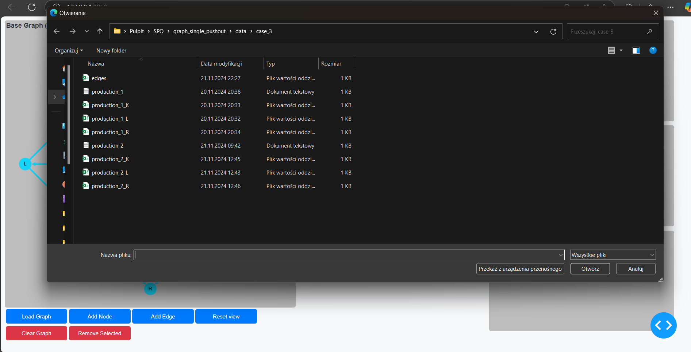

# Graph Double Pushout

This project implements a graph transformation system using the Double Pushout (DPO) approach. It includes a web application built with Dash for visualizing and interacting with graph transformations.

Collaborators:
- Tomasz Makowski
- Maciej Pieniążek
- Patryk Lesiak
- Wojciech Neuman

## Project Structure

- `app.py`: The main entry point for the Dash application.
- `callbacks.py`: Contains callback functions for the Dash application.
- `DoublePushout.py`: Implements the Double Pushout approach for graph transformations.
- `Graph.py`: Defines the `Graph` class and related functions.
- `layout.py`: Defines the layout for the Dash application.
- `ProductionParser.py`: Parses production rules for graph transformations.
- `utils.py`: Utility functions used throughout the project.
- `assets/`: Contains static assets like CSS files.
- `data/`: Contains sample data for graph transformations.
- `images_example/`: Contains images used in the README.
- `requirements.txt`: Lists the Python dependencies for the project.

## Installation

1. Clone the repository:
    ```sh
    git clone <repository-url>
    cd graph_double_pushout
    ```

2. Create a conda environment and activate it:
    ```sh
    conda create --name graph_double_pushout python=3.12
    conda activate graph_double_pushout
    ```

3. Install the dependencies:
    ```sh
    pip install -r requirements.txt
    ```

## Usage

1. Run the Dash application:
    ```sh
    python app.py
    ```

2. Open your web browser and navigate to `http://127.0.0.1:8050/` to interact with the application.

## Graph Representation

Graphs are stored in CSV files with four columns:
- `source_id`
- `source_label`
- `target_id`
- `target_label`

The `id` of the node makes it unique.

The base graph is represented by one CSV file. The production is represented by a TXT file, where the first line is the path to the L graph, the second line represents the K graph, and the third line represents the R graph.

#### Example

The base graph like the one below will represent the following output:

| source_id   | source_label   | target_id   | target_label   |
|:------------|:---------------|:------------|:---------------|
| B           | L              | A           | R              |
| C           | L              | A           | R              |
| D           | L              | A           | R              |
| B           | L              | C           | L              |
| C           | L              | D           | L              |
| B           | L              | D           | L              |


The L, K, and R graphs can be represented by the following TXT file and CSV files:

```
data/case_3/production_1_L.csv
data/case_3/production_1_K.csv
data/case_3/production_1_R.csv
```

production_1_L:

| source_id   | source_label   | target_id   | target_label   |
|:------------|:---------------|:------------|:---------------|
| X           | L              | Z           | R              |
| Y           | L              | Z           | R              |
| X           | L              | Y           | L              |

production_1_K:

| source_id   | source_label   | target_id   | target_label   |
|:------------|:---------------|:------------|:---------------|
| X           | L              | Z           | R              |
| Y           | L              | Z           | R              |

production_1_R:

| source_id   | source_label   | target_id   | target_label   |
|:------------|:---------------|:------------|:---------------|
| X           | L              | Z           | R              |
| Y           | L              | Z           | R              |
| V           | L              | Z           | R              |
| V           | L              | Y           | L              |
| V           | L              | X           | L              |

After loading it, the output will look like this:


## Example

1. After running the application, you will see the view presented below: 
2. Load the main graph by clicking the `Load Graph` button. The graph located in the path defined in the `GRAPH_FILE_PATH` variable will be loaded. 
3. After loading it, import the production by clicking the `Import Productions` button. A dialogue window will open where you should choose the TXT file that defines graphs L, K, and R. 
4. After choosing the production file, graphs L, K, and R are presented on the right side of the screen with color annotations (red for the part that is being removed, green for the part that is added). 
5. Then, click the `Apply Production` button. If the production is possible, the `Next Step` button will become active. Otherwise, a message indicating that the isomorphic graph cannot be found or that the double pushout cannot be performed will be displayed. 
6. You can see the following steps of the double pushout transformation by clicking either the `Next Step` or `Previous Step` buttons.     
7. If you click the `Save Production` button, the final graph will be assigned as the new base graph, and another transformation can be performed. 
8. Moreover, the `Reset View` button allows you to visualize the graph in the way you want it. Clicking it makes the nodes non-blocked, and you can move them freely to present the graph in a better view. 
9. You can then repeat the whole process of double pushout.
